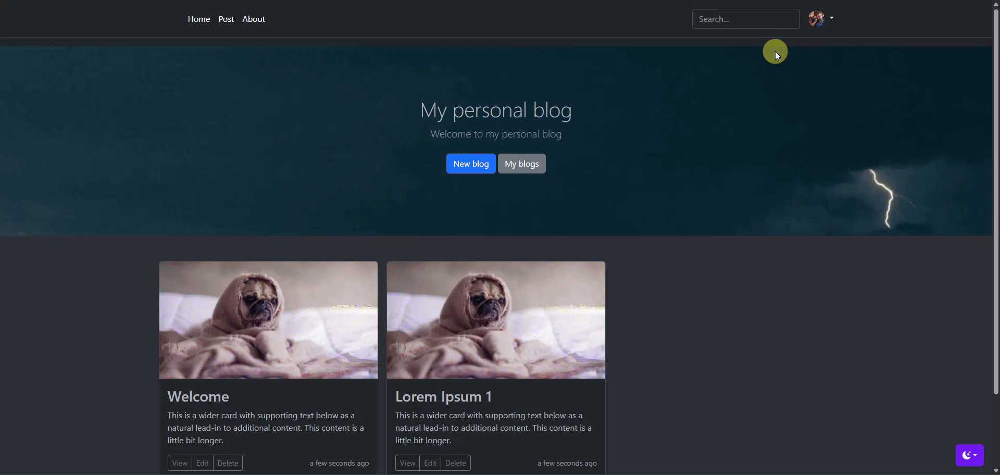
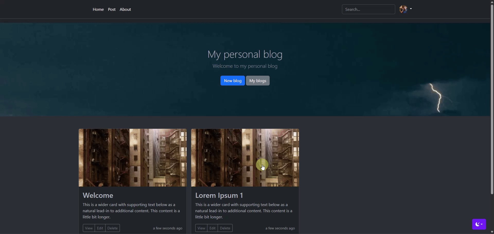
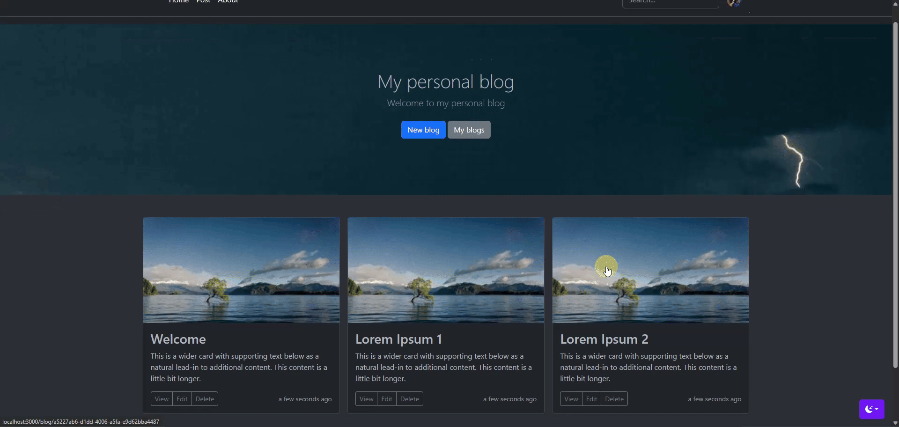
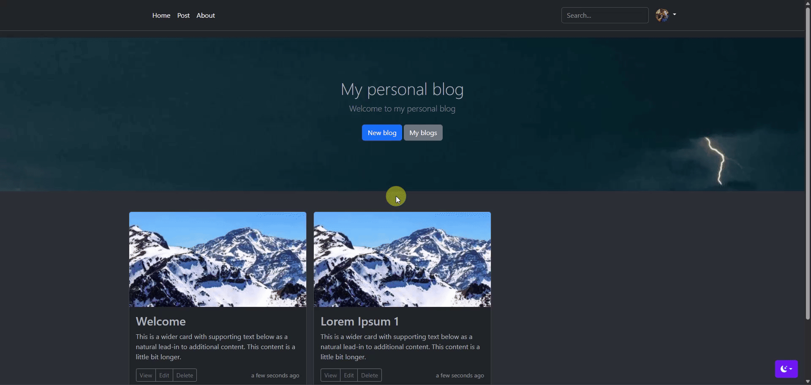

# Blog web application

The goal of this project is to create a Blog web application using Node.js, Express.js, and EJS. The application will allow users to create and view blog posts. Posts will not persist between sessions as no database will be used in this version of the application.

## Features
1. Post Creation: Users can create new posts.






2. Post Viewing: Users can view their posts from homepage


3. Post Update: Users can edit their posts as needed.


3. Post Delete: Users can delete their posts as needed.





## Stacks
- Node.js
- Express
- EJS (Embedded JavaScript templates)
- Bootstrap 5
- Multer (for image uploads)
- Moment.js (for relative time display)

## Project Structure
```
blog-web-app/
│
├── public/
│ ├── styles/
│ │ └── main.css
│ └── js/
│   └── color-modes.js
│
├── views/
│ ├── partials/
│ │ ├── footer.ejs
│ │ └── header.ejs
│ ├── index.ejs
│ ├── new.ejs
│ ├── edit.ejs
│ ├── delete.ejs
│ └── new.ejs
│
├── index.js
├── package.json
└── README.md
```

## Installation

1. **Clone the repository**

```bash
git clone https://github.com/natural-mess/Blog-Web-App.git
cd Blog-Web-App
```

2. **Install dependencies**

```bash
npm install
```

3. **Run the app**

```bash
node index.js
```

4. **Visit in browser**

```bash
http://localhost:3000
```

## Usage
- Click "New Blog" to create a post.
- After submitting, you're redirected to the blog content.
- Home page shows all blogs as thumbnails.
- Click "Edit" or "Delete" under each blog to modify or remove it.

## Limitations
- Blogs are stored in memory using a JavaScript Map – they are lost on server restart.
- No authentication or user accounts.
- No database integration (yet).

## To-Do / Future Improvements
- Add persistent storage (MongoDB or SQLite)
- Add user login/signup
- Allow tags and search
- Support markdown content
- Improve image upload handling

## Contributing
Pull requests are welcome! Please open an issue first to discuss your ideas.

## License
This project is open source and available under the MIT License.
Let me know if you'd like the README tailored with your GitHub repo link, author name, or instructions for deployment (e.g., Render, Heroku, etc.).
