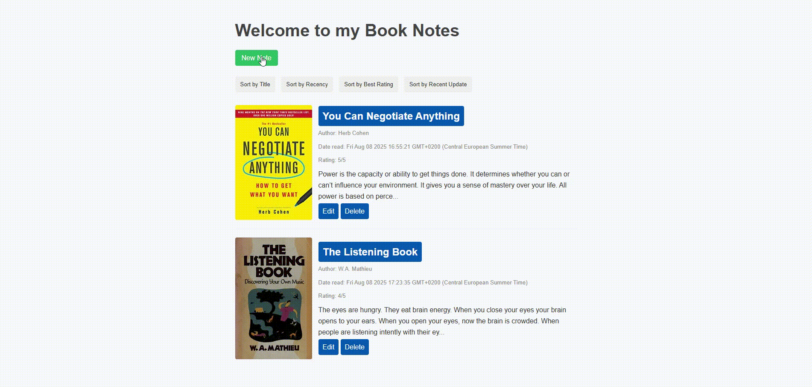
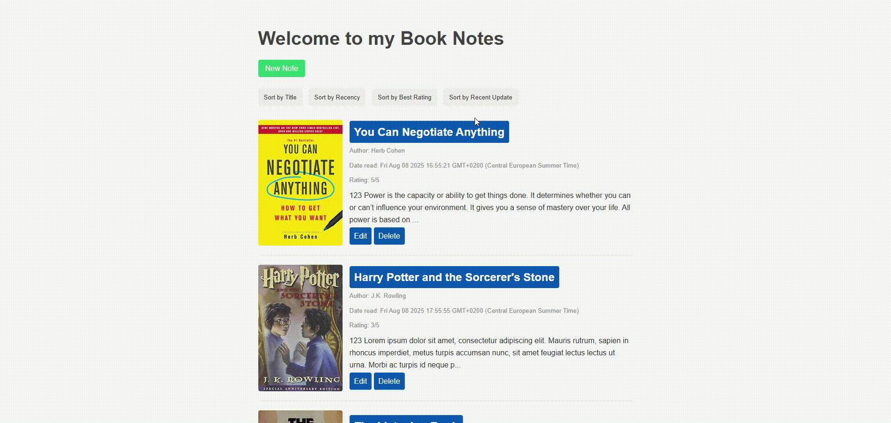
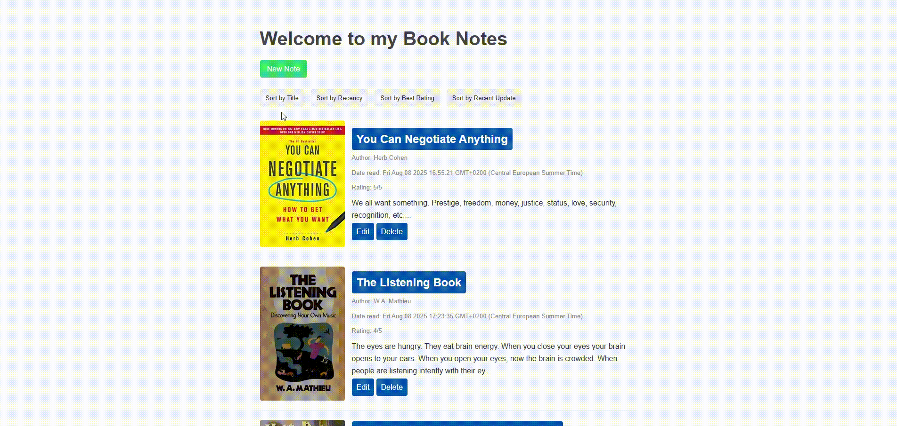
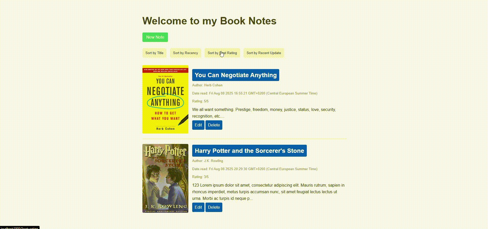

# BookNote-Web-App

A web app for saving and managing notes while reading books.

## Features

- Add new book notes with title, author, ISBN, rating, and personal notes
- Edit and delete existing notes
- Sort notes by title, recency, rating, or last update
- View book cover images via Open Library Covers API
- Responsive and clean UI

## Technologies Used

- Node.js
- Express.js
- PostgreSQL
- EJS templating
- Axios (for cover image validation)
- CSS (custom styles)

## Setup Instructions

1. **Clone the repository**
   ```
   git clone https://github.com/natural-mess/BookNote-Web-App.git
   cd BookNote-Web-App
   ```

2. **Install dependencies**
   ```
   npm install
   ```

3. **Set up PostgreSQL database**
   - Make sure PostgreSQL is installed and running.
   - Create a database named `booknote`.
   - Run the SQL script in `db/query.sql` to create the `books` table.

4. **Configure database connection**
   - Edit the database credentials in `index.js` if needed:
     ```js
     const db = new pg.Client({
       user: "postgres",
       host: "localhost",
       database: "booknote",
       password: "your_password",
       port: 5432,
     });
     ```

5. **Start the server**
   ```
   node index.js
   ```
   The app will run on [http://localhost:3000](http://localhost:3000).

## Database


## Usage

- Click "New Note" to add a new book note.  
  

- Edit or delete notes using the respective buttons.  
    
  

- Sort notes using the provided sort options.  
  

- ISBN is checked to ensure book is valid, otherwise, prompt user to type ISBN until it's correct  
  
## API Reference

- Book cover images are fetched from [Open Library Covers API](https://openlibrary.org/dev/docs/api/covers).

## License

This project is licensed under the MIT